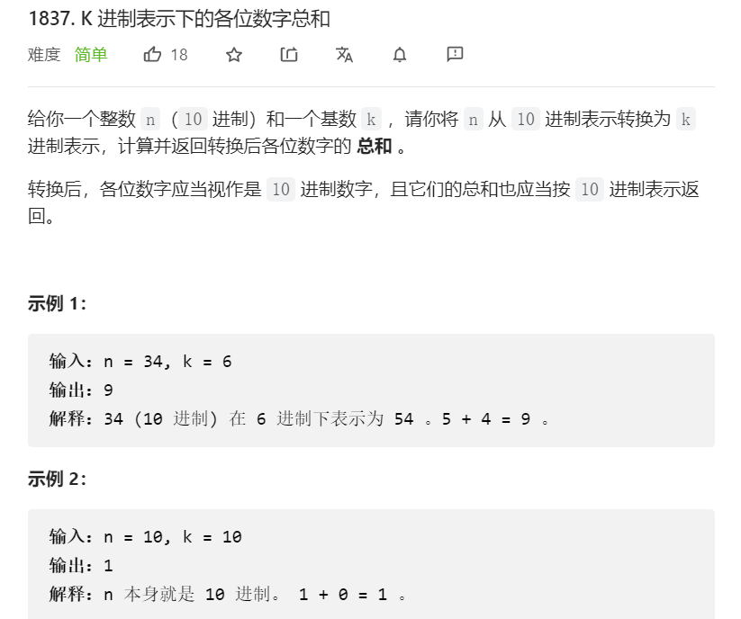

# DAY11 Sum of digits
方法一：字符串
```js
function sumBase(num) {
  let arr = num.toString().split("")
  return arr.reduce((a, b) => {
    return Number(a)+Number(b)
  })
}
console.log(sumBase(456))
```
方法二：递归的基础
```js
    function sumBase(num) {
      let ans = 0;
      while(num > 0){
      ans += num % 10;
      num = Math.floor(num / 10);
      }
      return ans;
    }
```
方法三：递归
```js
    function sumBase(num) {
      if(num===0) return 0;
      return num % 10 + sumBase(Math.floor(num/10));
    }
    console.log(sum(2394));
```

# LeetCode1837

```js
    function sumBase(n, k) {
        //加一步利用toString(k)转换为k进制
        n = parseInt(n.toString(k));
        if(n === 0) {
            return 0;
        }
        return (n % 10) + sumBase(parseInt(n / 10));
    }
```
