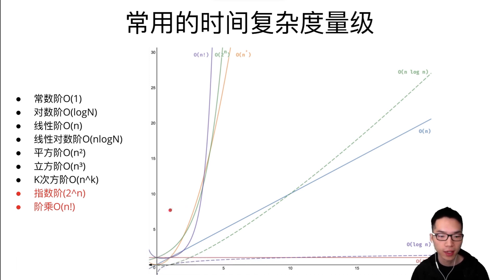

# DAY18 Algorithmic Complexity
# 程序
程序 = 数据结构 + 算法
- 数据结构：用来存储数据的基本单位（数组）
- 算法：实现特定目的的步骤

# 如何判断算法的好坏？
- 从时间维度判断：时间复杂度
- 从空间维度判断：空间复杂度

## 时间复杂度
时间空间增长的趋势

“大O表示法”算法的渐进时间复杂度

T(n) = O(f(n))



```js
let i = 1
while(i < n) {
    i = i*2
}
//另循环次数为k
// 2^k = N
// k = logN
//复杂度O(logN)
```

```js
for(let i=0; i<=n; i++) {
    let x = 1
    while(x < n) {
        x = x*2
    }
}
//在logN之外加一个N层循环
//复杂度O(NlogN)
```


O(1) < O(log n) < O( n ^ 1/2) < O(n) < O(nlogn) < O(n ^ 2) < O(n ^ 3) < O( 2 ^ n) < O( n! )


sort方法的复杂度是O(N^2)

排序需要两层for循环
## 空间复杂度
内存空间增长的趋势


