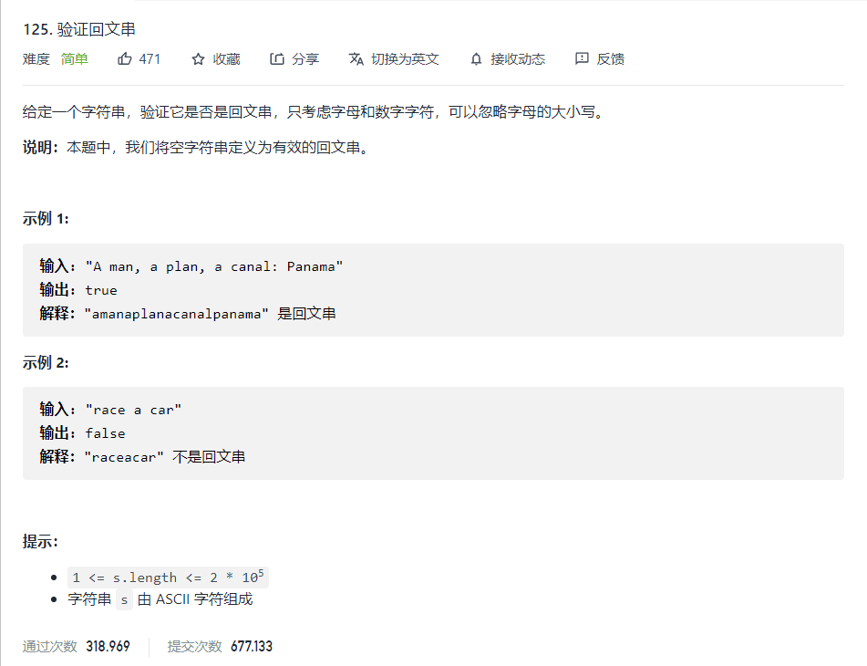

# DAY8 Check if a string is Palindrome


## 方法一：全反过来判断
```js
let isPalindrome = function(s) {
    s = s.replace(/[^a-zA-Z0-9]/ig, '').toLocaleLowerCase();
    let s1 = s.split("").reverse().join("");
    return s===s1;
};
```
## 方法二：for循环
```js
function isPalindrome(str) {
    //先将字符串无关东西去掉且都转换为小写
str = str.replace(/[^a-zA-Z0-9]/ig, "").toLocaleLowerCase();
    //将前半部分与后半部分作比较，所以只需比较到字符串的一半
for(let i=0; i<str.length/2; i++) {
    if(str[i]!==str[str.length-1-i]) {
        return false;
    } return true;
}
}
```

## 方法二的进阶版方法
```js
let isPalindrome = function (s) {
  s = s.replace(/[^a-zA-Z0-9]/g, "").toLocaleLowerCase()
  let left = 0
  let right = s.length - 1
  while (left < right) {
    if (s[left] !== s[right]) return false
    left += 1
    right -= 1
  }
  return true
}
```

## 方法三：利用stack
```js
let isPalindrome = function (s) {
  s = s.replace(/[^a-zA-Z0-9]/g, "").toLocaleLowerCase()
  let stack = s.split("")
  for (let i = 0; i < s.length / 2; i++) {
    const x = stack.pop()
    if (x !== s[i]) return false
  }
  return true
}
```

