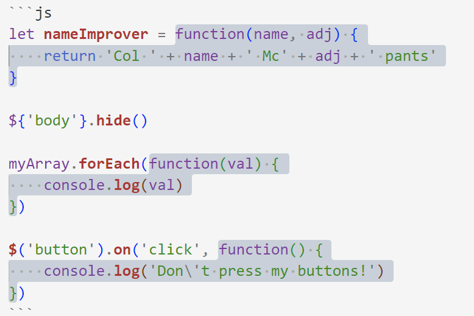
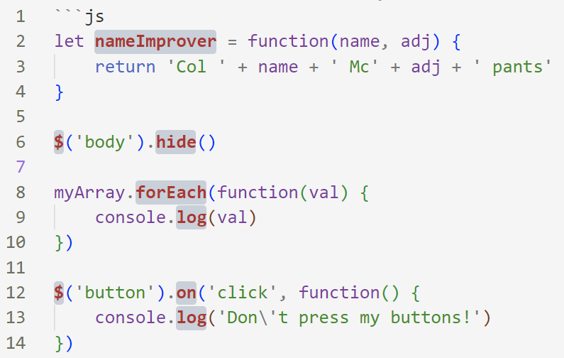
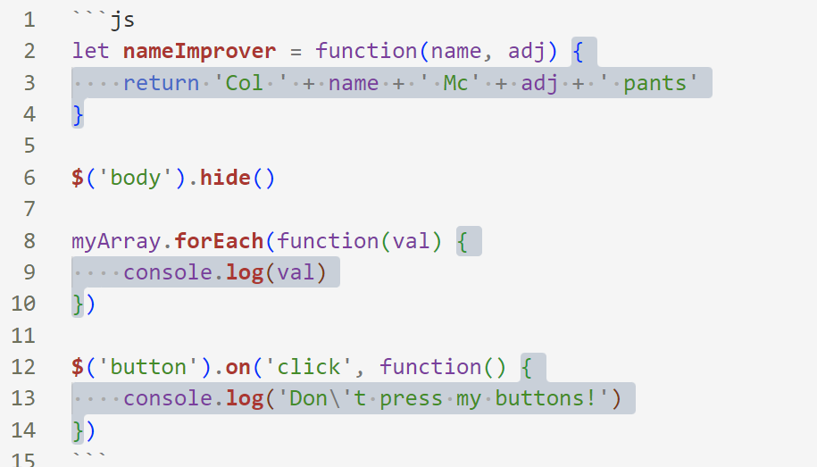
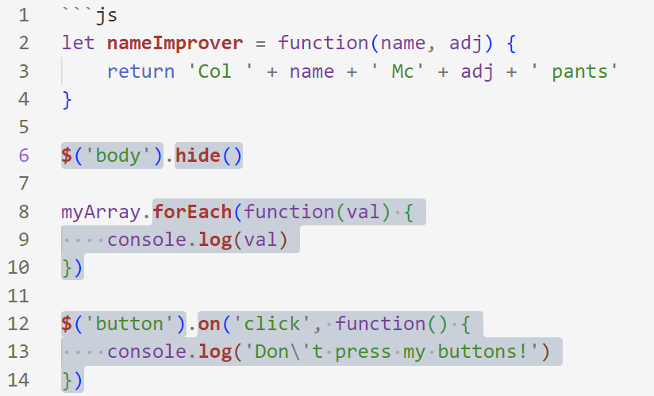
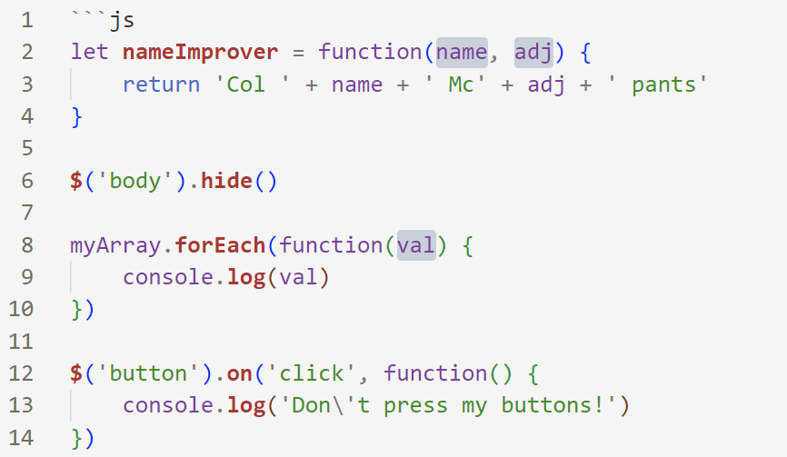
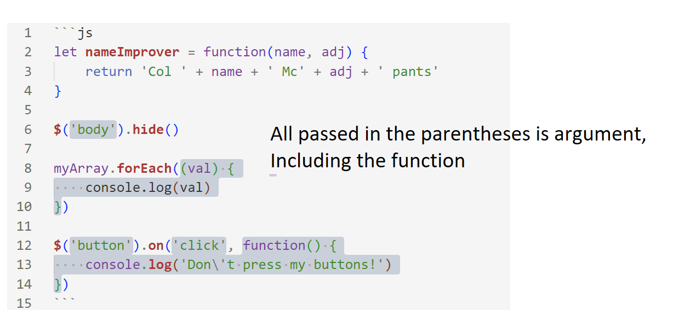

# 1. Function
```js
let nameImprover = function(name, adj) {
    return 'Col ' + name + ' Mc' + adj + ' pants'
}

$('body').hide()

myArray.forEach((val) {
    console.log(val)
})

$('button').on('click', function() {
    console.log('Don\'t press my buttons!')
})
```
## Function Definition


## Function Name


## Function Body


## Function Invocation

Also, the .log( ) in the function body will be a kind of function invocation when the outside function is called.

## Function Parameter


## Function Argument


# 2. Arrow Function
> Arrow functions don't have thrie own value for this, and they inherit, they reach up into the parent scope and grab that value of this.

## Exercise: 
return an array['', '', ''] only including the names of suspects who are present
```js
const videoData = [
    {
        name: 'Miss Scarlet',
        present: true,
        rooms: [
            {kitchen: false},
            {ballroom: false},
            {conservatory: false},
            {'dining room': false},
            {'billiard room': false},
            {library: false}
        ]
    },
    {
        name: 'Mrs. White',
        present: false,
        rooms: [
            {kitchen: false},
            {ballroom: false},
            {conservatory: false},
            {'dining room': false},
            {'billiard room': false},
            {library: false}
        ]
    },
    {
        name: 'Reverend Green',
        present: true,
        rooms: [
            {kitchen: false},
            {ballroom: false},
            {conservatory: false},
            {'dining room': false},
            {'billiard room': false},
            {library: false}
        ]
    },
    {
        name: 'Rusty',
        present: false,
        rooms: [
            {kitchen: false},
            {ballroom: false},
            {conservatory: false},
            {'dining room': false},
            {'billiard room': false},
            {library: false}
        ]
    },
    {
        name: 'Colonel Mustard',
        present: true,
        rooms: [
            {kitchen: false},
            {ballroom: false},
            {conservatory: false},
            {'dining room': false},
            {'billiard room': false},
            {library: false}
        ]
    },
    {
        name: 'Professor Plum',
        present: true,
        rooms: [
            {kitchen: false},
            {ballroom: false},
            {conservatory: false},
            {'dining room': false},
            {'billiard room': false},
            {library: false}
        ]
    }
];
const presentSuspects = _.filter(videoData, element => {
    return element.present
})
const suspectsNames = _.map(presentSuspects, element => {
    return element.name
})
// videoData.filter((element, index, list) => {
//   return element.present
// }).map((element, index, list) => {
//   return element.name
// })
```

# 3. Arguments Keyword
> Arguments is an pseudo array. 类数组
```js
function createTuple(a, b, c, ...d) {
    console.log(arguments)
    //["It", "be", "could", "anyone", "no one"]
    return [[a, c], [b, d]]
}
createTuple("It", "be", "could", "anyone", "no one")
```
The operator has nothing to do with what arguments prints out.

# Default parameter
```js
const add = function(a, b = 2) {
    console.log(arguments)//3
    return a+b
}
add(3)//5
```
```js
//ES5
const add = function(a, b) {
    b = b || 2
    console.log(arguments)//3
    return a+b
}
add(3)//5
```

# Array.from( )处理类数组问题
```js
const constructArray = function(...arg) {
    const arr = Array.from(arguments)
    arr.push("the billiards room?")
    return arr.join(" ")
}
console.log(constructArray("Was", "it", "in"))
```

# Under the hood of _.from( )
```js
const from = pseudoArr => {
return Array.prototype.slice.call(pseudoArr)
}
```
# Functions are also Objects
So you can also add property to a function

```js
function add(a, b) {
    return a+b 
}
add.example = "test 123!"
console.log(add.example)
//test 123!
```
